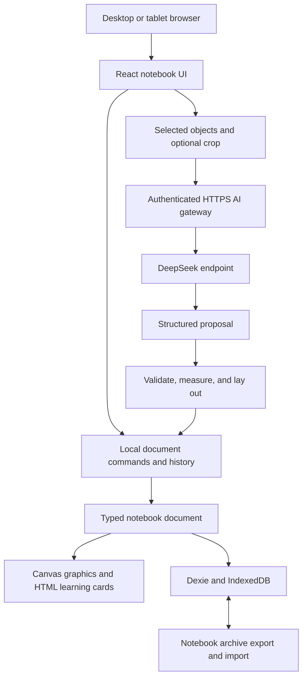

# AI Interactive Learning Notebook: Technical Research and Recommendations

## 1. Recommendation

Build a responsive web application with an offline notebook, editable learning objects, and an explicitly invoked DeepSeek assistant. Use existing rendering, ink, layout, and storage libraries, while owning the notebook document format, learning widgets, and validated AI command layer.

The leading canvas approach is **React + Konva + perfect-freehand, with HTML components for equations, text editing, and quizzes**. This is a provisional architecture recommendation, not a demonstrated performance winner. Give Excalidraw a serious, time-limited comparison before committing: it supplies much more of a complete editor, and its embeddable renderer may support the required learning cards. The deciding test is whether editable cards, ink, selection, undo, and export work together on real tablets.

Do not build a graphics renderer from scratch. Equally, do not mistake a rendering library for a finished notebook editor: a Konva implementation still needs considerable interaction engineering. The first implementation milestone should resolve this cost before the rest of the product depends on it.

The recommended application stack is **React, TypeScript, Vite, Dexie/IndexedDB, a small TypeScript HTTPS gateway, and DeepSeek**. Start with an infinite scene organized into notebook pages and optional bounded paper frames. Automatic synchronization, a PostgreSQL deployment, a Python service, and a native desktop wrapper can wait.

## 2. Scope and evidence

The product requirements come from `idea.md`: personal handwritten notes, a shared visual learning space, editable AI diagrams, contextual explanations, quizzes, and eventually adaptive learning. The initial requirements also include desktop and tablet support, DeepSeek API access, and separate local notebooks with export/import instead of automatic synchronization.

This report evaluates public documentation, current license files, model API references, and selected original learning research, accessed on **13 September 2026**. Recommendations, proposed interfaces, effort estimates, and acceptance thresholds are engineering judgments. No application has been implemented, no physical stylus tests have been run, and no authenticated DeepSeek requests have been benchmarked. Repository main branches and model catalogs can change; record exact package versions and model configuration during the implementation spike.

Use the direct DeepSeek API initially. The exact tablet models, pens, account balance, and API access remain unverified. These are implementation inputs, not reasons to postpone the plan. A future self-hosted inference service would need its own capability checks; it is outside the initial scope.

The first usable release should support this sequence:

1. Open a notebook and write or draw without any AI connection.
2. Ask for a short lesson; receive editable text, an equation or diagram, and a question on the scene.
3. Annotate the lesson, select an object, and request an explanation beside it.
4. Answer a stored MCQ locally and review the explanation.
5. Undo an AI insertion without deleting handwriting added while the request was running.
6. Close, reopen, and transfer the notebook to another device through a complete archive.

## 3. Canvas: buy the foundation, build the learning behavior

### Options compared

The assessments below concern fit for this product, not universal rankings. “Custom work” means work the application must implement and maintain.

| Option | What it provides | Main limitation for this notebook | Recommendation |
|---|---|---|---|
| **tldraw SDK** | An extensible editor with custom shapes, tools, bindings, history, and persistence APIs | Current SDK license is not permissive open source; production and downstream deployments require appropriate licenses | Strong technical reference and accelerated alternative if its licensing is deliberately accepted |
| **Excalidraw** | A ready React whiteboard, drawing, selection, scene updates, and export; MIT licensed | Interactive educational objects must fit existing elements/embeddables or an integration layer; extension and export behavior require proof | Primary challenger in the first spike; choose it if the required experience works without a long-lived fork |
| **Konva + react-konva + perfect-freehand** | Canvas scene rendering, object events/transforms, React integration, and pressure-aware ink geometry; permissive components | Application must build camera/gestures, history, lasso, connector binding, semantic objects, accessibility, and combined export | Leading long-term candidate for custom learning objects, subject to a successful spike |
| **Fabric.js** | An object-oriented canvas editor foundation with selection, controls, and JSON/SVG facilities | Gesture and eraser behavior are version-sensitive; interactive HTML cards still need integration | Viable if vector/SVG editing becomes the dominant requirement |
| **React Flow** | Custom React nodes, ports, and edges for node-based interfaces; MIT core | Freehand notebook input and arbitrary spatial content are additional systems | Useful reference; not the main notebook surface |
| **BlockSuite** | Page and edgeless editors, custom blocks, rich text, and a Yjs-based document model; MPL-2.0 | More opinionated editor/runtime integration; extension surfaces and package compatibility need validation | Worth a secondary spike if rich documents become more important than pen-first interaction |
| **Raw Canvas/WebGL/SVG engine** | Complete control | Rendering plus all editor behavior becomes project-owned | Reject for the initial product |

The official libraries and extension documentation support these distinctions; capability does not establish tablet quality or performance at this application's scale.[^1][^2][^3][^4][^5][^6][^7]

Check example licenses separately from library licenses: React Flow's official freehand example uses its Pro license even though the core library is MIT.[^29]

### The tldraw licensing decision

tldraw's current documentation explicitly distinguishes its source-available SDK from open-source examples. Its default SDK terms permit development use; production needs a trial, commercial, or discretionary hobby license. The documentation also states that downstream users of an open-source project need their own production licenses. An application's own source code can be open while this dependency retains those conditions.[^1]

For an application intended to be easy to fork and self-host, this is a material distribution cost. Do not assume old descriptions of tldraw as MIT apply to the current SDK. A permissive example or agent starter does not change the underlying SDK license. Prefer the permissive candidate unless the editor time saved justifies that dependency explicitly.

### Why Konva is the leading hypothesis

Quizzes, revealable answers, equations, editable explanations, and later flashcards are central document objects. An application-owned schema can represent them directly, while Konva handles graphical primitives and React renders interactive controls. perfect-freehand can turn captured pointer samples into pressure-sensitive stroke outlines; it is an ink geometry component, not handwriting recognition.[^3][^8]

Use a small, explicit visual layering policy: paper/grid, graphical objects and connectors, educational HTML cards, annotations above cards, then temporary selections and tools. Route input according to the active mode. In pen mode, ink can be written over a card; in interaction mode, its answer buttons receive input. Do not promise unrestricted interleaving of arbitrary DOM and canvas layers in the first version.

Persist application records rather than serializing a Konva stage as the database. Konva itself recommends application-state serialization for complex applications. Its HTML portal is not included in ordinary canvas export, which makes a separate export renderer a required feature.[^9][^10]

Excalidraw may still be the better first release choice. If an embeddable quiz can be selected, moved, duplicated, restored, and exported reliably, its ready-made editor can save substantial time. Its documented custom renderer means “custom cards are impossible” is too strong a conclusion. Test the actual integration instead of deciding from a feature list.[^2]

### The engine decision test

Time-box a comparison to **4–5 focused engineering days**. Build the same small scene in Excalidraw and the Konva hybrid: a handwritten equation, highlighter marks, three connected nodes, editable text, one equation card, and one MCQ card. This is the only justified competing implementation; do not maintain two engines afterward.

Measure on a Windows desktop, a physical iPad with Pencil in Safari, and a physical Android tablet with a pen in Chrome where available. Document any untested device rather than treating browser emulation as stylus validation.

| Gate | Required result |
|---|---|
| Ink and touch | Pen writes consistently; fingers pan/pinch in pen mode; interrupting a stroke does not leave a stuck tool |
| Cards | A quiz is operable by touch/keyboard, movable as one object, and editable after save/load |
| Selection | Lasso semantics are clear; mixed strokes and cards can move without losing relationships |
| Diagram editing | Moving a node preserves its connector relationships |
| History | One AI batch undoes independently of later user ink |
| Portability | Archive restores all content; image export contains cards and equations |
| Load behavior | The scene remains usable with a representative large notebook page; instrument frame times and memory |
| Ownership | No required proprietary key, undocumented engine patch, or fragile fork for the chosen path |

Choose Excalidraw if it passes the product gates with less integration effort. Otherwise proceed with Konva only after estimating its editor backlog. If both fail card integration, reconsider BlockSuite or narrow the initial interactions. If both fail physical handwriting quality, reassess browser versus native ink; another browser editor may share the same input limitations. Changing the rendering adapter is possible later, but it is not a free migration.

## 4. Desktop and tablet experience

### Input behavior

Use Pointer Events as the common input layer, preserve real pen pressure where reported, and provide constant-width fallback. Feature-detect coalesced samples; predicted samples may improve temporary rendering but must not become persisted ink. Pointer capture, cancellation, and explicit touch behavior matter more than a large collection of pen styles. Browser event specifications expose the data but do not guarantee hardware sampling quality or palm rejection.[^11]

Implement a small interaction state machine: `select`, `pen`, `highlighter`, `eraser`, `pan`, and `edit-card`. A physical pen defaults to ink; fingers navigate while pen mode is active. Provide an explicit finger-drawing option, visible toolbar eraser, and keyboard alternatives. Do not depend on a stylus barrel button or Pencil gesture being available through every browser.

Start with whole-stroke erasing. The proposed partial eraser would later split stroke geometry while preserving pressure and undo information; persistent vector masks are another approach, but selection and export must respect them. Highlighter ink should have predictable transparency and should not accidentally erase lesson content. Lasso initially selects complete intersecting strokes and objects, subject to the engine spike; partial stroke extraction can wait.

During drawing, keep live samples in a transient buffer and schedule rendering per frame. Commit a completed stroke as one command. Save after commands, not after every pointer movement. Use viewport culling and separate transient ink from expensive card updates. A scene contains world coordinates; viewport dimensions and device pixel ratio affect rendering, not stored positions.

### Pages, paper, and lessons

Use one scene model. A notebook has ordered pages, each with a camera state and either an infinite background or a bounded paper frame. A paper frame is a layout/export boundary, not a second editor implementation. Begin with one paper preset and a free canvas; postpone paginated word-processor behavior and automatic content reflow between sheets.

Generate lessons as short sections with writing space beside them. On a tablet, a floating selection menu and a collapsible request sheet preserve canvas room. On a desktop, a compact sidebar can show requests, sources, and previous actions. Keep the generated learning content on the canvas in both layouts.

Use explicit handles to move cards, ordinary HTML controls to answer questions, and a clear editing mode for text. Provide a linear reading view of scene text, equations, and questions for keyboard and assistive-technology use. WCAG's keyboard and target-size guidance informs these choices; a spatial canvas alone does not provide an accessible reading order.[^12]

## 5. Application architecture



### Recommended stack and alternatives

| Layer | Initial choice | Why; condition for an alternative |
|---|---|---|
| Frontend | React + TypeScript + Vite | The editor is client-driven; server rendering adds little to the core notebook |
| Styling | CSS/Tailwind, accessible React controls | Use a small consistent UI; avoid creating a separate design system project |
| Canvas | Decision-gated Konva hybrid or Excalidraw | Resolve through the comparison above |
| Shared schema | Zod + TypeScript | Runtime validation for imported files, AI output, and commands; infer application types |
| Local database | Dexie over IndexedDB | Offline structured records and binary assets with migrations/transactions |
| AI gateway | TypeScript on Node, a small HTTP router such as Hono | Shares contracts with the browser and keeps the DeepSeek key server-side |
| Transport | HTTPS request with streamed response events | No WebSocket infrastructure needed for one bounded generation request |
| Equations | KaTeX | Store LaTeX source; render display content; use restricted trust settings |
| Diagram layout | Dagre first | Small directed diagrams; consider ELK for ports, compound layouts, and more demanding routing |
| Verification | Unit/contract tests + Playwright + physical-device tests | Automated checks cover logic; device tests cover real handwriting and mobile ergonomics |

Vite, Dexie, KaTeX, Dagre, and ELK document these roles. ELK computes positions; it does not create an interactive diagram editor.[^13][^14][^15][^16][^17]

Next.js remains reasonable if authenticated cloud features become the main product or existing experience makes it faster. FastAPI remains reasonable for substantial Python OCR/ML pipelines. Neither is required to call DeepSeek. Avoid a Next.js application, separate FastAPI API, PostgreSQL, Redis, vector database, and agent framework before proving the core experience.

### Hosting and API keys

Serve the built frontend and AI gateway from one HTTPS origin. For personal use, one self-hosted Node service behind HTTPS is sufficient; the gateway needs no notebook database. Configure the DeepSeek key as a server secret, and protect the gateway with a private login/session or equivalent private access. Same-origin requests simplify cookies and cross-origin behavior.

A tablet's `localhost` is the tablet, not the desktop. A laptop development server is suitable for desktop development, but tablet testing needs a reachable origin. Service workers require a secure context; the localhost development exception does not make an arbitrary HTTP LAN address equivalent to HTTPS.[^18]

For the open-source release, distribute the application and a reproducible gateway setup; each self-hoster supplies their own DeepSeek key. Do not distribute one shared public key, compile a key into frontend environment variables, or save it in notebook archives. DeepSeek's Open Platform terms explicitly require keeping keys out of browser/client code, so direct browser inference with an exposed key is excluded from this design.[^23]

The PWA caches the application shell and needed static assets. Notebook storage uses IndexedDB. AI requests remain online and should not be automatically replayed after a connection returns. Opening a previously installed/cached notebook, writing, saving, and answering generated questions must continue without the gateway.

## 6. Document model, saving, and portability

### One authoritative document

Do not maintain a scene JSON blob, separate object rows, separate stroke rows, and engine state as independent editable copies. For the Konva path, the application document is authoritative and the scene is a projection of it. If Excalidraw wins, explicitly define its scene records plus versioned educational payloads as the authoritative representation; the adapter must update them together. Neither path should involve uncontrolled two-way synchronization between stores.

Recommended application entities:

| Entity | Essential contents |
|---|---|
| Notebook | ID, title, ordered page IDs, schema version, timestamps |
| Page | ID, mode, paper settings, object order, local revision |
| CanvasObject | ID, kind, geometry/transform, style, parent/group, typed payload, object revision |
| Stroke object | Point samples including pressure/time where available, brush options, bounds |
| Diagram objects | Editable node objects and connector objects with endpoint IDs/ports |
| Learning card | Text/equation/quiz/flashcard payload, concept IDs, accessible reading position |
| Asset | Content hash, media type, bytes, size, optional original filename |
| AI provenance | Request ID, model/configuration, source object IDs/revisions, creation time |
| QuizAttempt | Immutable attempt ID, question ID and version, selected option ID, hints/reveal state, timestamp |
| ConceptEvidence | Derived summary of attempts and reviews, with evidence count and last practiced time |

A stroke is a canvas object; it should not be duplicated in two persistence models. Keep camera, hover state, current selection, live pen samples, and network progress out of the portable document unless there is a clear restoration benefit.

### Saving and recovery

Persist completed commands in short IndexedDB transactions and display saving status based on successful commits. Retain a recoverable previous snapshot and version all migrations. A browser kill can still interrupt an unfinished stroke or pending save; state the durability boundary rather than promising that any visible pixel is already saved.

Allow one writable tab per notebook initially, with explicit takeover after the previous writer closes or fails. Local-only storage does not prevent two tabs from overwriting one another. Defer service-worker activation/reload until pending edits are persisted, and test that cached application versions cannot write an incompatible database schema.

Browser storage is scoped to an origin and browser profile. Persistence requests may be denied, and users can delete stored data. Moving the application to another domain does not move its IndexedDB contents. These limitations make archive export and restore essential even when the notebook works offline.[^19]

The portable format should be a ZIP-style `.ainotebook` archive containing a manifest, versioned page/object data, content-addressed assets, quiz attempts, review history, and source/AI provenance. Exclude credentials, session tokens, and diagnostic logs. Include a human-readable Markdown export of text, plus static page previews when available. Hash checks and schema validation should run before import changes the current notebook.

Import an existing notebook ID as a copy by default or explicitly replace it after making a backup. Preserve or consistently remap all object, attempt, and provenance references when copying. Handle truncated archives, unsupported future versions, excessive decompressed sizes, missing assets, and corrupt object references. The archive is the transfer mechanism between desktop and tablet; editing the two imported copies does not synchronize them.

JSON Canvas is useful as an optional interchange export for text/file nodes and links. Its published format does not cover this notebook's full ink and interactive assessment semantics, so it should not be the only backup format.[^20]

## 7. DeepSeek integration

### API boundary

DeepSeek documents the direct endpoint `POST https://api.deepseek.com/chat/completions`. Use ordinary server-side HTTP or an OpenAI-compatible transport client with a DeepSeek key. The SDK's name does not imply an OpenAI service dependency.[^21]

Keep a small adapter with capabilities such as `text`, `images`, `streaming`, `nativeTools`, and `schemaMode`. Capability entries must identify the endpoint/model/configuration tested, not merely the provider name. Disable unsupported UI actions rather than silently sending image content to a text-only model.

The current live documentation recommends `deepseek-flash`, mapped to DeepSeek-V4.1-Flash. Older Flash/vision-exp names are compatibility aliases for that model, not separate recommended integrations. Use current API identifiers rather than copying an older tutorial.[^21]

| Candidate | Documented capability | Proposed use |
|---|---|---|
| `deepseek-flash` | Text, vision, JSON output, and tool calls | First candidate for lessons, selected-content explanation, and handwriting crops |
| `deepseek-v4-pro` | Text, JSON output, and tool calls; no vision | Optional text-reasoning comparison if evaluation justifies it |

These are documented capabilities, not a claim of access or comparative accuracy in this application.[^22] Explicitly disable thinking for routine schema/tool generation, then evaluate thinking mode for harder explanations. Do not silently send image-dependent requests to Pro. Keep the model name and settings configurable and record the returned model identifier with provenance.

### Structured output strategy

The canvas agent can work with structured response data without autonomous native tool calling. The user action already identifies the task: explain, teach, quiz, or diagram. Request one bounded result in the application's schema, then validate and execute locally.

DeepSeek documents strict tool schemas as a **beta** feature using the `/beta` base URL and `strict: true` on every function. Its schema subset omits some length/array limits; enforce those in the application. Prefer one named `propose_canvas_patch` function with thinking disabled after the beta path passes a capability test. The Chat Completions reference disallows forced/required tool choice in thinking mode.[^30][^31]

Use stable JSON Output plus local validation as a fallback. JSON Output requires `response_format: {"type":"json_object"}` and an explicit JSON instruction/example; it is not a full application-schema guarantee and can return empty or truncated content. Permit one repair, then leave the document unchanged.[^32]

The capability spike must check tool-argument reconstruction across streaming chunks, terminal status and usage, keep-alive handling, cancellation, and separation of final payload from reasoning fields. If multi-round thinking/tool use is later added, follow DeepSeek's reasoning-history rules inside the request session rather than placing reasoning traces on the notebook.[^33][^34]

The detailed DeepSeek candidate table and capability probe are in [the AI research memo](research/ai-research.md). No model should be declared best from parameter count or an unrelated benchmark. Selection depends on schema validity, teaching correctness, diagram consistency, selected-ink interpretation, response time, and available access.

### Access, cost, and privacy assumptions

DeepSeek uses token-based API billing. The following USD rates per million tokens were checked on 13 September 2026; use the live pricing page and actual account billing when implementing.[^22]

| Model | Input, cache miss: off-peak / peak | Input, cache hit: off-peak / peak | Output: off-peak / peak |
|---|---:|---:|---:|
| `deepseek-flash` | $0.15 / $0.30 | $0.003 / $0.006 | $0.60 / $1.20 |
| `deepseek-v4-pro` | $0.66 / $1.32 | $0.022 / $0.044 | $1.98 / $3.96 |

For a transparent planning example, assume 600 actions/month, each using 4,000 uncached input tokens and 2,000 total billed output tokens. Flash costs about **$1.08 off-peak or $2.16 peak** for those tokens; 10% extra requests of the same size gives approximately **$1.19–$2.38**. This excludes image tokens, additional reasoning, longer lessons, hosting, and any taxes. It is an illustrative workload calculation, not an expected bill. The pricing page defines weekday UTC peak periods; do not delay an interactive lesson to chase discounts.

Keep the key on the gateway and show which selected content is being sent. Local storage does not make remote inference private to the device. Do not claim zero retention or no training without an applicable API agreement that establishes it; review the Open Platform terms for the deployed service.[^23]

Start with one in-flight request across the gateway/account, short lesson sections, bounded context/output, cancellation, and retry backoff. This is an application policy, not the provider's published concurrency limit. Preserve provider error details in redacted diagnostics, keep notebook content out of routine logs, and handle insufficient balance or unavailable models without interrupting note-taking. Cache accepted lessons and grade stored MCQs locally.

## 8. How the AI tools should work

### Two layers of tools

Expose semantic operations to the model; use lower-level document commands inside the application. This keeps an AI response meaningful even if the canvas engine changes.

| Model-facing operation | Purpose | Deterministic application work |
|---|---|---|
| `insert_lesson_section` | Heading, explanation, worked example, optional check question | Validate blocks, measure cards, place a section, create objects |
| `insert_explanation` | Explain selected content at an appropriate level | Attach source references and place an adjacent card |
| `insert_diagram` | Nodes, labels, relationships, direction | Measure, run graph layout, create editable nodes/connectors |
| `insert_equation` | LaTeX plus explanation and assumptions | Parse/render safely and preserve editable source |
| `insert_quiz` | Question, stable option IDs, answer key, rationale, concept tags | Validate answer structure and build a local interactive widget |
| `insert_flashcards` | Prompt/answer pairs from source content | Persist cards, link sources, add review UI |
| `propose_object_update` | A bounded edit to selected existing content | Check allowed IDs/revisions, preview replacement, apply atomically |

The first release only needs the first five operations. Highlight, group, move, and update commands can be added behind the same validator. There is no need to expose a general-purpose `eval`, browser controller, filesystem tool, network fetch tool, SQL tool, or arbitrary engine JSON to the model.

Illustrative semantic payload, not an implemented API:

```json
{
  "type": "insert_diagram",
  "anchor": {"relation": "after_selection"},
  "title": "Gradient descent",
  "direction": "left_to_right",
  "nodes": [
    {"localId": "prediction", "label": "Prediction"},
    {"localId": "loss", "label": "Loss"},
    {"localId": "update", "label": "Update parameters"}
  ],
  "edges": [
    {"from": "prediction", "to": "loss"},
    {"from": "loss", "to": "update", "label": "use gradient"}
  ]
}
```

The application adds the real page ID, request ID, source versions, permissions, and transaction ID from trusted request state. It maps local node IDs to new persistent IDs. The model cannot choose another notebook or grant itself broader edit rights.

### Context selection

Use the selected objects first, their connected neighbors or enclosing lesson next, and only a small amount of relevant earlier context. Send plain text from typed cards, LaTeX from equations, and semantic node/edge descriptions from diagrams. Strokes are geometry, not recognized words; do not represent raw pen points as if they convey readable text to a language model.

For handwritten content, create a bounded image of the selected region with enough margin to preserve mathematical context. Render selected content to a separate export surface so unrelated objects under the same rectangle are not accidentally included. Preserve the mapping between the crop, page coordinates, and selected IDs. Where a crop needs surrounding context, make that visible in the request preview.

A proposed initial text-context budget is roughly 8,000 tokens plus one cropped image where supported, tuned after measurement. The limit is an application policy, not a claim about DeepSeek's model context window. Expand context explicitly when a selection omits essential prerequisites; do not continuously upload the entire notebook.

### Execution and undo

1. Capture the request's selection, permitted targets, and object versions.
2. Generate a draft. Partial streamed JSON stays in the draft area.
3. Validate schema, string/object limits, enum values, identifiers, edges, and quiz answer keys.
4. Treat notes, uploaded sources, and model output as untrusted data; they cannot redefine command permissions.
5. Resolve semantic placement, measure text/equations, lay out diagrams, and reject impossible results.
6. Re-check targets against the current document. Unrelated new handwriting should not invalidate an additive result. A geometry-only move can be re-anchored; edited source content requires regeneration or an explicit stale draft, and a deleted target cannot be silently replaced with another object.
7. Apply the accepted change as one local command transaction and persist it.
8. Store provenance and expose Undo, retry, and edit actions.

An explicit “Teach” or “Explain” action can authorize additive content to appear in a reserved area once validated. Replacements and deletions should use a concrete preview. Do not make every harmless addition require another confirmation, but do not overwrite user work because the model suggested it.

Idempotency is local: an already committed transaction ID cannot create the same objects again after reconnection or retry. Network calls may still be repeated or consume quota, so track attempt IDs separately. If a response arrives after switching pages, retain it for its original page rather than inserting into the newly visible one.

Do not keep one editor history transaction open during a network request. User strokes committed while waiting must retain their own undo entries. “Undo AI” should inverse only that batch; subsequent edits to those generated objects require a conflict-aware decision instead of deleting them blindly.

### Layout is a compiler responsibility

The model chooses content and relationships. The application chooses typography, card width, gaps, precise coordinates, and connector routing. Measure rendered labels first, use Dagre for a simple directed graph, then turn layout results into normal editable objects. ELK is a later option for complex port-aware diagrams.[^16][^17]

Reserve a lesson region, use deterministic templates, and leave space for annotations. Moving a generated node updates its connector endpoints using IDs. Do not rerun global layout whenever a student moves an object; only arrange the selected diagram or new section. Reflowing the whole scene can detach handwriting from what it explains.

## 9. Handwriting, equations, and educational correctness

### Recognition in stages

Initial handwriting is vector ink. The first AI features can work on typed text and editable diagrams while the vision path is tested. For selected handwritten regions, start with a DeepSeek vision model if its endpoint passes the capability and accuracy checks. Keep the original ink and attach the recognized text/LaTeX as a derived interpretation with a source hash.

For checking mathematics, show the interpretation before judging the work. A missed minus sign or exponent can change the answer completely. Give the student a way to correct the transcription. Specialized OCR/math recognition is worth evaluating later if repeated errors justify another dependency and its costs; continuous whole-notebook OCR is unnecessary.

Store equations as LaTeX, render with KaTeX using untrusted-input settings, bound macro expansion, and show readable errors. Rendering valid LaTeX is not mathematical verification. Symbolic checking can later be added for tightly specified problems, with explicit variables, assumptions, domains, units, and tolerances.[^15]

### Quiz behavior and mastery

Generate the question, answer key, explanations, and concept tags together. Store stable option IDs and persist the displayed option order for each attempt. Checking a stored MCQ is local. This is a self-study design, not secure exam software: a technically skilled user could inspect a client-stored answer key.

Schema validation can check that the answer references one option, but cannot establish that it is correct. Evaluate distractors, ambiguity, explanation consistency, and alignment with the lesson. Store source references when the quiz is grounded in notes; general model knowledge should not be presented as a source-verified textbook answer.

Prefer “not practiced,” “needs review,” and “practicing confidently,” backed by counts and recency, to unsupported mastery percentages. Keep raw attempts, first-attempt versus repeated answers, hint use, and solution reveals. An explanation request is not proof that a learner lacks understanding, and repeated attempts on the same MCQ are not independent mastery evidence.

Later, add a review scheduler such as the MIT-licensed `ts-fsrs`; it schedules retrieval practice rather than proving concept mastery.[^24] Start recommendations with transparent rules: review a recently missed prerequisite, offer another example, or schedule another question. A trained student model has little value without enough trustworthy data.

### Learning design supported by research

Karpicke and Blunt's experiments found benefits from retrieval practice relative to concept-map study for the science-text tasks tested. This supports including recall activities, but does not establish that any AI canvas improves learning.[^25]

Bastani and colleagues' high-school mathematics field experiment found that unrestricted AI assistance could improve assisted practice while reducing performance after assistance was removed; a tutor designed around learning safeguards mitigated that downside. This result concerns a particular population and intervention, not every AI tutor. The published correction concerns an author affiliation.[^26][^27]

For this application, use short explanations, worked examples, an invitation to attempt a problem, progressive hints, and later unaided questions. Let a learner ask for a full solution, while preserving whether it was revealed in the learning record. Evaluate retention and transfer separately from whether the generated board looks attractive.

## 10. Import, export, retrieval, and later extensions

**Exports belong early.** A complete editable archive is the primary backup. A static PNG and printable lesson/page view must include ink, HTML cards, equations, and connectors. Render from the document model to a dedicated export composition; a screenshot of the currently visible canvas is insufficient for an infinite page. Vector-quality PDF/SVG requires additional rendering work and should not be promised merely because ink is stored as vectors.[^10]

**PDF import belongs after the editor is reliable.** Use PDF.js's display layer to render pages and extract available text. Store the original PDF as an asset, keep annotations in the notebook model, and retain page-number/region references. Digital PDF text, scanned-page OCR, reading order, and textbook equations are separate cases. PDF.js is a rendering/parsing foundation, not a universal document-understanding system.[^28]

**Retrieval should begin with structure.** Searching titles, typed text, concept tags, and selected lesson IDs may be sufficient for a personal collection. Add embedding retrieval only when larger course materials make it useful. At that point, chunk by section/page, preserve citations and hashes, update indexes after edits, and test whether retrieved passages actually support the answer.

**Synchronization is a later feature.** Local archive transfer is accepted for the first version. A future single-user sync server can start with versioned snapshots and explicit conflict copies. Real simultaneous editing needs a more deliberate merge design; adding Yjs later affects document granularity, undo origins, assets, and conflict semantics. It is not a checkbox.[^7]

**Native packaging is conditional.** A desktop wrapper does not solve tablet handwriting. Consider Tauri/Electron or native mobile surfaces only after identifying a specific need such as filesystem integration or unacceptable browser pen behavior. Preserve the schema and AI contracts even if the renderer changes.

## 11. Delivery scope, effort, and release gates

### Realistic release boundaries

The two-week schedule in `idea.md` is reasonable for a narrowly controlled concept demonstration, especially with a prebuilt editor. It is not a defensible commitment for a dependable cross-device notebook containing custom history, pressure ink, editable interactive cards, recovery, exports, and validated AI behavior.

For one experienced developer working approximately full time, the planning estimate is **8–12 weeks to a useful personal alpha** on the more custom canvas path, including the initial spike and some integration contingency. A first open-source release adds roughly **2–3 weeks** of packaging, documentation, migration/restore checks, and hardening. These are estimates, not measured velocity; limited tablet access or a failed engine spike can extend them.

| Release | Included | Deliberately later |
|---|---|---|
| Two-week concept demo | One scene/page; essential ink; one generated section; editable diagram; one MCQ; basic save/load | Broad device assurance, sophisticated erasing, automatic mastery, full import/export coverage |
| Personal alpha | Reliable core notebook on tested desktop/tablet devices; archive transfer; DeepSeek generation; selected typed-content explanation; equations/quizzes; safe history and failures | PDF/RAG, collaboration, voice, predictive mastery |
| Subsequent learning release | Selected handwriting interpretation if validated, flashcards, review scheduling, source-grounded PDF lessons | Live continuous AI observation and complex student models |
| Open-source release | Reproducible setup, BYOK gateway, mock AI mode, documentation, license notices, compatibility matrix, upgrade/restore instructions | A free hosted inference service or automatic SaaS operation |

The detailed implementation sequence, dependencies, and acceptance criteria are in [IMPLEMENTATION_PLAN.md](IMPLEMENTATION_PLAN.md).

### Acceptance criteria

All numerical thresholds below are proposed targets to measure, not results already achieved.

| Area | Evidence required before personal alpha |
|---|---|
| Offline notebook | A 30-minute write/edit session works without network; reopening restores successfully committed content |
| Hardware | Complete the pen/touch/card matrix on actual supported devices; publish exact OS/browser/pen combinations |
| Performance | Target near-60 Hz navigation on a 60 Hz target device; record p95 frame time and long stalls with 2,000 strokes and 100 mixed learning objects |
| Recovery | Round-trip archives on desktop/tablet; exercise storage-full, corrupt archive, interrupted save, and schema migration cases |
| AI contracts | Reject every invalid/unauthorized mutation in the fixed test suite; duplicate responses never duplicate committed objects |
| AI generation | On at least 50 representative prompts, target at least 95% valid bounded proposals after at most one repair; track content correctness separately |
| Quiz quality | Manually review at least 50 generated items for answer correctness, ambiguity, and explanation consistency; fix recurrent failure patterns |
| Context | Selected handwritten/typed content is correctly scoped; no accidental whole-notebook upload |
| Latency | Log time to first complete useful section and total completion; aim for a useful section within 15 seconds where provider conditions permit |
| Independence | Ordinary writing, undo, saving, and answering stored MCQs produce zero DeepSeek requests |

Testing on a small corpus estimates reliability; it cannot guarantee future model answers. Treat content errors and handwriting uncertainty as visible correction workflows, not just backend exceptions.

## 12. Open-source strategy and outstanding decisions

Prepare for open source from the first commit: application-owned contracts, explicit dependency licenses, no personal notebooks in examples, no credentials in fixtures, and a deterministic mock DeepSeek adapter. An MIT license for original application code is a reasonable default for easy reuse, subject to the final dependency selection; no project license is applied by this report. Preserve third-party notices and review the exact dependencies that are shipped.

Publish a small reference notebook using original content. Document installation, HTTPS access from a tablet, local data locations, backup/restore, model configuration, account requirements, and limitations. CI should run without paid AI credentials; live model evaluation should be a deliberate separate job with synthetic fixtures and bounded usage.

The remaining decisions are concrete:

| Decision | Recommended default | How it is resolved |
|---|---|---|
| Canvas engine | Konva hybrid hypothesis, Excalidraw challenger | Same-scene 4–5 day spike and editor-work estimate |
| Actual tablet compatibility | iPad/Safari and Android/Chrome intended | Real hardware matrix, with untested combinations disclosed |
| DeepSeek model | One model selected by task evaluation | Capability probe, access verification, 50-prompt evaluation |
| DeepSeek access and cost | Direct API with server-side key | Verify account access/balance and measured token consumption |
| Automatic sync | Deferred | Already scoped to export/import initially |
| Pen sophistication | One pen, highlighter, whole-stroke eraser | Add styles/partial erasing only after stable core input |
| Mastery | Evidence counts and review states | Add calibrated scores only with validated data |

The most valuable first deliverable is the shared-scene prototype plus a mock AI transaction. It can establish whether the notebook remains comfortable to write in while editable learning content, undo, saving, and export behave correctly. DeepSeek integration then connects to an already-defined document system.

For implementation detail, see the supporting [canvas comparison](research/canvas-research.md), [AI tool and DeepSeek memo](research/ai-research.md), and [storage/deployment memo](research/architecture-research.md). The decisions and release scope above take precedence over optional alternatives discussed in those memos.

## Sources

All online sources below were accessed 13 September 2026. Undated documentation is identified by publisher and page title; repository licenses describe the browsed branch and must be rechecked at the pinned dependency version. Source `idea.md` is the local product concept supplied for this project.

[^1]: tldraw. [License](https://tldraw.dev/community/license) and [current SDK license file](https://github.com/tldraw/tldraw/blob/main/LICENSE.md). Production licensing and downstream distribution.
[^2]: Excalidraw. [Repository and MIT license](https://github.com/excalidraw/excalidraw); [render props](https://docs.excalidraw.com/docs/@excalidraw/excalidraw/api/props/render-props), including `renderEmbeddable`. Editor integration and custom content.
[^3]: Konva. [Official documentation](https://konvajs.org/docs/) and [MIT license](https://github.com/konvajs/konva/blob/master/LICENSE). Rendering foundation.
[^4]: Fabric.js. [Official site](https://fabricjs.com/) and [v6 breaking changes discussion](https://github.com/fabricjs/fabric.js/issues/8299). Version-specific migration and interaction caveats.
[^5]: XYFlow. [React Flow](https://reactflow.dev/) and [source repository](https://github.com/xyflow/xyflow). Node-editor capabilities and core licensing.
[^6]: BlockSuite. [Edgeless Editor](https://blocksuite.io/components/editors/edgeless-editor) and [Block Spec](https://blocksuite.io/guide/block-spec). Shared document/editor and extension surfaces.
[^7]: Toeverything. [BlockSuite repository](https://github.com/toeverything/blocksuite) and [license](https://github.com/toeverything/blocksuite/blob/main/LICENSE). Yjs-backed model, runtime design, and MPL-2.0.
[^8]: Steve Ruiz and contributors. [perfect-freehand](https://github.com/steveruizok/perfect-freehand). Pressure-sensitive stroke geometry and usage.
[^9]: Konva. [Save and Load Best Practices](https://konvajs.org/docs/data_and_serialization/Best_Practices.html). Application-state persistence.
[^10]: Konva. [Render DOM elements inside a canvas stage](https://konvajs.org/docs/react/DOM_Portal.html). HTML portal export limitation.
[^11]: W3C. [Pointer Events](https://www.w3.org/TR/pointerevents/), particularly coalesced/predicted events and pointer lifecycle. Living specification; browser support must be tested.
[^12]: W3C. [Web Content Accessibility Guidelines 2.2](https://www.w3.org/TR/WCAG22/). Keyboard access and input target guidance.
[^13]: Vite. [Guide](https://vite.dev/guide/). Frontend development/build tooling.
[^14]: Dexie.js. [Documentation](https://dexie.org/docs/) and [Version.upgrade](https://dexie.org/docs/Version/Version.upgrade()). IndexedDB data access and migrations.
[^15]: KaTeX. [Security](https://katex.org/docs/security) and [Options](https://katex.org/docs/options). Untrusted equation rendering.
[^16]: Dagre contributors. [Dagre repository](https://github.com/dagrejs/dagre). Client-side directed graph layout and MIT licensing.
[^17]: Eclipse/KIELER. [elkjs repository](https://github.com/kieler/elkjs) and [ELK graph data structure](https://eclipse.dev/elk/documentation/tooldevelopers/graphdatastructure.html). Layout scope, nodes, ports, and edges.
[^18]: MDN Web Docs. [Service Worker API](https://developer.mozilla.org/en-US/docs/Web/API/Service_Worker_API). Offline shell and secure-context requirements.
[^19]: MDN Web Docs. [Storage quotas and eviction criteria](https://developer.mozilla.org/en-US/docs/Web/API/Storage_API/Storage_quotas_and_eviction_criteria). Browser storage durability and origin scope.
[^20]: Obsidian. [JSON Canvas specification 1.0](https://jsoncanvas.org/spec/1.0/) and [announcement](https://obsidian.md/blog/json-canvas/), 11 March 2024. Interchange scope and open format.
[^21]: DeepSeek. [Your First API Call](https://api-docs.deepseek.com/). Direct API endpoint and current model identifiers.
[^22]: DeepSeek. [Models & Pricing](https://api-docs.deepseek.com/quick_start/pricing/). Current capabilities, USD token rates, and peak/off-peak periods. Live documentation checked 13 September 2026.
[^23]: DeepSeek. [Open Platform Terms of Service](https://cdn.deepseek.com/policies/en-US/deepseek-open-platform-terms-of-service.html), effective 29 April 2026. API-specific service and credential requirements.
[^24]: Open Spaced Repetition. [ts-fsrs repository](https://github.com/open-spaced-repetition/ts-fsrs) and [MIT license](https://github.com/open-spaced-repetition/ts-fsrs/blob/main/LICENSE). Review scheduling library.
[^25]: Jeffrey D. Karpicke and Janell R. Blunt. [Retrieval Practice Produces More Learning than Elaborative Studying with Concept Mapping](https://learninglab.psych.purdue.edu/downloads/2011/2011_Karpicke_Blunt_Science.pdf). Science, 331, 772–775, 2011. Original study.
[^26]: Hamsa Bastani et al. [Generative AI without guardrails can harm learning: Evidence from high school mathematics](https://doi.org/10.1073/pnas.2422633122). PNAS, published 25 June 2025. Original field experiment; updated online article.
[^27]: PNAS. [Correction for Bastani et al.](https://pmc.ncbi.nlm.nih.gov/articles/PMC12403119/), 20 August 2025. Author-affiliation correction.
[^28]: Mozilla. [PDF.js Getting Started](https://mozilla.github.io/pdf.js/getting_started/). Display/core/viewer architecture.
[^29]: XYFlow. [Freehand Draw example](https://reactflow.dev/examples/whiteboard/freehand-draw). Example-specific Pro license.
[^30]: DeepSeek. [Tool Calls](https://api-docs.deepseek.com/guides/tool_calls/). Strict beta mode and supported schema subset.
[^31]: DeepSeek. [Chat Completions API](https://api-docs.deepseek.com/api/create-chat-completion/). Tool choice restrictions, streaming, and response structure.
[^32]: DeepSeek. [JSON Output](https://api-docs.deepseek.com/guides/json_mode/). Configuration, empty-output caveat, and truncation.
[^33]: DeepSeek. [Thinking Mode](https://api-docs.deepseek.com/guides/thinking_mode/). Explicit mode control and tool-conversation history.
[^34]: DeepSeek. [Rate Limit & Isolation](https://api-docs.deepseek.com/quick_start/rate_limit/). Account concurrency and keep-alive transport behavior.
